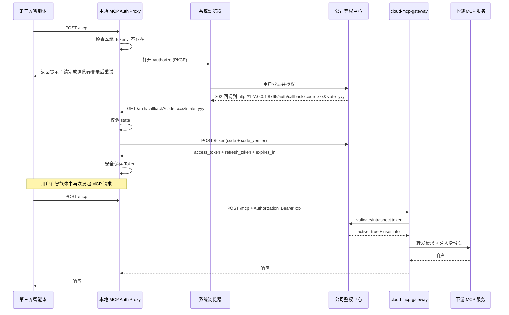
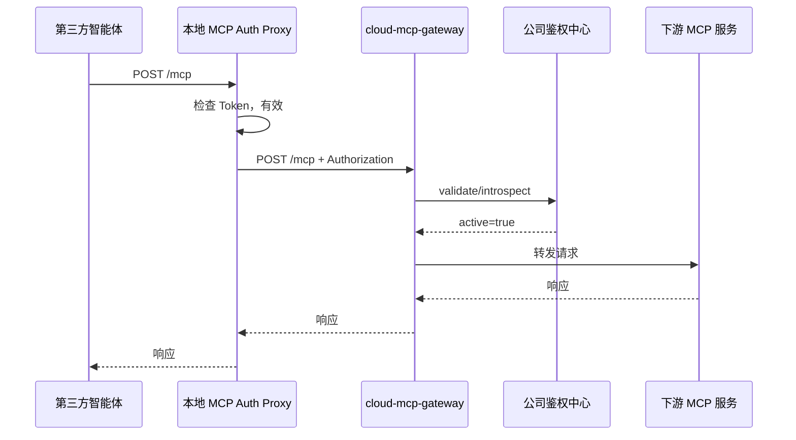
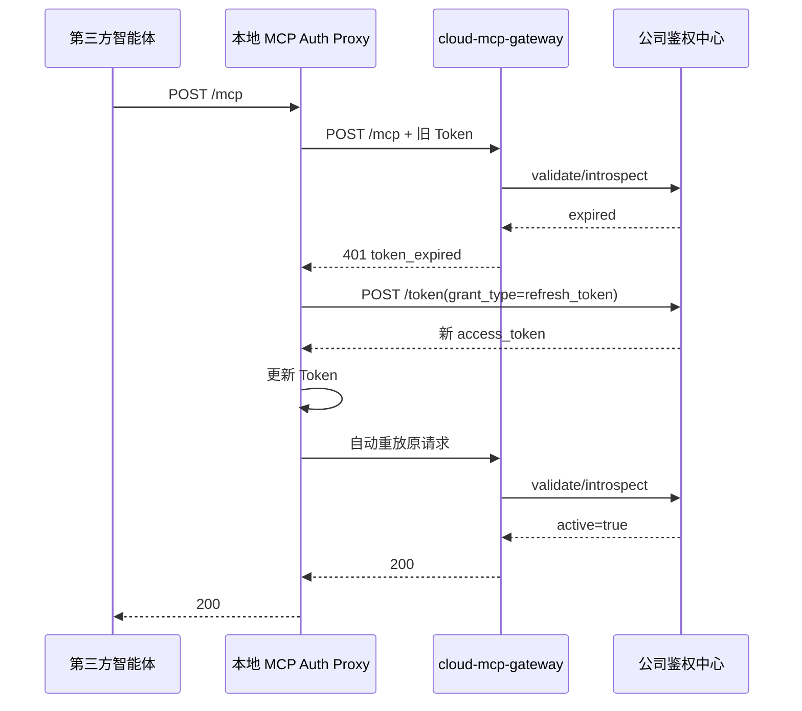
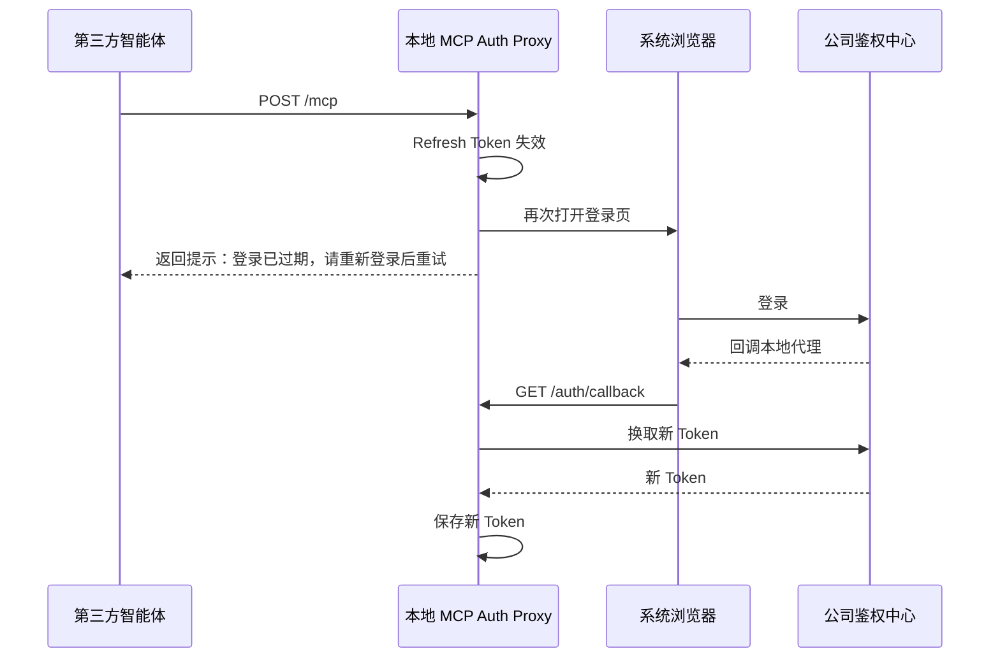

# MCP Gateway 接入公司鉴权体系详细设计方案

## 1. 文档信息

- 项目：`cloud-mcp-gateway`
- 主题：MCP Gateway 集成公司内部鉴权体系（方案一：网关远程校验 Token）
- 版本：`v1.0`
- 日期：`2026-03-06`

---

## 2. 背景与目标

当前项目是一个基于 Spring Cloud Gateway + WebFlux 的 MCP Gateway，用于对外暴露统一的 MCP 访问入口，并将请求转发给注册在 Nacos 上的下游 MCP 服务。

本次设计目标如下：

1. 将公司内部鉴权体系接入 MCP Gateway。
2. 当第三方智能体首次访问时，如果没有公司 Token，能够引导用户完成浏览器登录。
3. 登录完成后，Token 不由第三方智能体直接管理，而由本地认证代理统一保存与续期。
4. 后续所有 MCP 请求都自动携带 Token 调用网关。
5. 网关通过公司鉴权中心远程校验 Token，并将身份透传给下游服务。
6. 为后续 tool 级别授权、审计、限流留好扩展点。

---

## 3. 当前项目现状

当前项目已经具备基础鉴权雏形：

- 网关入口配置为 MCP Streamable HTTP：`src/main/resources/application.yml`
- MCP 入口路径为：`/mcp`
- 项目已存在 `AuthFilter`，能够读取 `Authorization` 请求头并调用鉴权中心做布尔校验
- `/mcp/**` 路由已挂载该过滤器
- 已预留鉴权中心配置项：`auth.auth-center-url`、`auth.validate-endpoint`

当前实现仍然较为初级，主要不足如下：

1. 鉴权结果仅返回 `true/false`，无法透传用户身份。
2. 失败时只返回空 `401`，无法指导上游做后续动作。
3. 没有 Token 缓存、无超时降级、无结构化错误响应。
4. 没有本地认证代理，第三方智能体无法自主完成 OAuth 回调和 Token 保存。

---

## 4. 设计结论

## 4.1 总体结论

由于智能体不是公司内部开发，无法假设其具备以下能力：

- 拉起浏览器登录
- 接收 OAuth 回调
- 安全存储 Access Token / Refresh Token
- 处理 Token 过期与自动刷新
- 在 MCP 请求中自动附加并维护企业 Token

因此，不建议让第三方智能体直接对接公司鉴权中心。

**推荐架构：引入本地 `MCP Auth Proxy`。**

第三方智能体仅需要把 MCP 地址配置为本地代理，例如：

`http://127.0.0.1:8765/mcp`

本地代理负责：

- 首次检测未登录
- 拉起浏览器完成公司登录
- 接收本地回调
- 换取并保存 Token
- 自动将 Token 加到对网关的请求中
- Token 过期时自动刷新或重新登录

网关继续采用方案一：**收到 Bearer Token 后，远程调用公司鉴权中心做校验**。

## 4.2 推荐认证协议

推荐使用：

- `OAuth2 Authorization Code + PKCE`

不推荐：

- 浏览器直接把 `access_token` 放到回调 URL 中
- 第三方智能体自己保存公司 Token
- 仅依赖内网、IP、Nacos 注册信息作为身份认证依据

---

## 5. 总体架构设计

## 5.1 架构角色

系统包含以下五个角色：

1. **第三方智能体**
   - 仅作为 MCP Consumer。
   - 不直接参与 OAuth 登录流程。

2. **本地 MCP Auth Proxy**
   - 暴露本地 MCP 地址给第三方智能体。
   - 负责浏览器登录、回调、Token 存储、自动刷新、请求转发。

3. **公司鉴权中心**
   - 提供授权、登录、换 Token、校验 Token 等能力。

4. **cloud-mcp-gateway**
   - 校验 Bearer Token。
   - 提取身份信息。
   - 注入身份头并转发给下游 MCP 服务。

5. **下游 MCP 服务**
   - 接收网关转发请求。
   - 可按用户身份做进一步授权。

## 5.2 请求路径

完整访问链路如下：

`第三方智能体 -> 本地 MCP Auth Proxy -> cloud-mcp-gateway -> 公司鉴权中心 -> 下游 MCP 服务`

---

## 6. 时序图

## 6.1 首次访问：无 Token



## 6.2 后续访问：本地已有有效 Token



## 6.3 Token 过期：自动刷新



## 6.4 刷新失败：重新登录



---

## 7. 各端职责与开发内容

## 7.1 第三方智能体侧

第三方智能体不参与公司认证协议实现，仅需要做最小接入。

### 需要完成的内容

1. 配置 MCP 地址为本地代理地址，例如：`http://127.0.0.1:8765/mcp`
2. 在首次收到认证提示时，将错误消息展示给用户
3. 用户完成登录后，重新发起 MCP 请求

### 不要求第三方智能体具备的能力

1. 不要求实现 OAuth2/OIDC 客户端
2. 不要求保存 Access Token / Refresh Token
3. 不要求处理 Token 刷新
4. 不要求理解公司鉴权中心协议

---

## 7.2 本地 MCP Auth Proxy 侧

本地代理是整个方案中最核心的新组件。

### 需要开发的模块

#### 1. MCP 转发模块

职责：

- 暴露本地 `POST /mcp`
- 接收第三方智能体的 MCP 请求
- 原样转发到远端 `cloud-mcp-gateway`
- 支持透传请求体、响应体、状态码、必要响应头

#### 2. Token 状态管理模块

职责：

- 检查 Token 是否存在
- 判断 Token 是否过期
- 判断是否需要刷新
- 避免多请求并发触发重复登录

建议数据结构：

```json
{
  "access_token": "***",
  "refresh_token": "***",
  "expires_at": 1777777777,
  "scope": "mcp.invoke mcp.read",
  "user_id": "u12345",
  "user_name": "zhangsan"
}
```

#### 3. OAuth2 PKCE 登录模块

职责：

- 生成 `code_verifier`
- 计算 `code_challenge`
- 生成 `state`
- 拼装浏览器登录地址
- 拉起系统浏览器

示例授权请求参数：

- `response_type=code`
- `client_id=<proxy-client-id>`
- `redirect_uri=http://127.0.0.1:8765/auth/callback`
- `scope=mcp.invoke mcp.read`
- `code_challenge=<...>`
- `code_challenge_method=S256`
- `state=<random>`

#### 4. 回调接收模块

职责：

- 本地监听 `127.0.0.1:<port>`
- 接收 `GET /auth/callback?code=...&state=...`
- 校验 `state`
- 对用户返回成功页面，例如“登录成功，请回到智能体重试”

#### 5. Token 交换与刷新模块

职责：

- 用 `authorization_code` 换 `access_token`
- 用 `refresh_token` 刷新 `access_token`
- 更新本地缓存与安全存储

#### 6. 安全存储模块

职责：

- 在本机安全保存 Token
- 避免明文落盘

建议实现：

- Windows：Credential Manager
- macOS：Keychain
- Linux：Secret Service / libsecret

#### 7. 自动重试模块

职责：

- 请求网关返回 `401 token_expired` 时自动刷新
- 刷新成功后自动重放原 MCP 请求
- 防止重复重放

#### 8. 本地运维接口模块

建议提供：

- `GET /auth/status`
- `POST /auth/login`
- `POST /auth/logout`

### 本地代理推荐技术栈

可以选以下任一实现：

1. **Java / Spring Boot WebFlux**
   - 便于和现有项目技术栈统一
2. **Node.js / Express 或 Fastify**
   - 实现桌面代理、浏览器拉起更轻量
3. **Go**
   - 单二进制部署，适合发布给终端用户

推荐优先级：

- 如果由网关团队统一维护：优先 `Java`
- 如果更重视桌面分发与轻量运行：优先 `Go`

---

## 7.3 公司鉴权中心侧

### 需要提供的能力

#### 1. 授权端点

例如：

- `GET /oauth2/authorize`

职责：

- 展示登录页
- 用户登录并授权
- 回调本地代理

#### 2. Token 端点

例如：

- `POST /oauth2/token`

职责：

- 支持 `authorization_code`
- 支持 `refresh_token`

#### 3. Token 校验端点

例如：

- `POST /oauth2/introspect`
- 或内部 `GET /api/auth/validate`

职责：

- 校验 Access Token 是否有效
- 返回用户身份、租户、角色、Scope、过期时间

推荐返回格式：

```json
{
  "active": true,
  "user_id": "u12345",
  "user_name": "zhangsan",
  "tenant_id": "t001",
  "roles": ["mcp_user", "ops_reader"],
  "scopes": ["mcp.invoke", "mcp.read"],
  "exp": 1777777777
}
```

#### 4. 回调地址注册能力

需要允许注册 loopback 回调，例如：

- `http://127.0.0.1:8765/auth/callback`
- 或支持某范围端口的 loopback callback

---

## 7.4 cloud-mcp-gateway 侧

网关是本次改造的核心服务端。

### 需要开发的内容

#### 1. 认证过滤器增强

当前 `AuthFilter` 只做布尔校验，需要改造成：

- 从 `Authorization` 中读取 Bearer Token
- 调公司鉴权中心远程校验
- 解析用户身份信息
- 成功后将身份注入转发请求头
- 失败时返回结构化错误 JSON

#### 2. 结构化错误返回

至少区分以下错误场景：

- `auth_required`
- `invalid_token`
- `token_expired`
- `auth_service_unavailable`

示例：

```json
{
  "error": "auth_required",
  "message": "Authentication required",
  "trace_id": "8c1f7d2a4d0f4f3b"
}
```

#### 3. 身份透传

建议向下游 MCP 服务注入以下头：

- `X-User-Id`
- `X-User-Name`
- `X-Tenant-Id`
- `X-User-Roles`
- `X-User-Scopes`
- `X-Auth-Source`

同时必须先清理客户端自带的同名 Header，避免伪造。

#### 4. Token 校验缓存

建议对 Token 校验结果做短 TTL 缓存，例如：

- 30 秒到 120 秒

作用：

- 减少每个 MCP 请求都打到鉴权中心
- 降低整体 RT
- 缓解鉴权中心压力

#### 5. 白名单与运维接口

建议保留不鉴权的接口：

- `/actuator/health`
- `/actuator/info`

#### 6. 审计日志

建议记录：

- 请求时间
- 用户 ID
- 租户 ID
- 来源客户端
- MCP 路径
- 工具名（如可解析）
- 响应状态
- 耗时
- Trace ID

---

## 7.5 下游 MCP 服务侧

### 第一阶段

- 可以先不改造，只依赖网关的认证结果

### 第二阶段

- 读取 `X-User-*` 头
- 对 MCP Tool / Resource 做细粒度授权
- 增加调用审计

---

## 8. 接口与报文设计

## 8.1 本地代理接口

### 1. `POST /mcp`

作用：

- 第三方智能体唯一需要访问的 MCP 入口

### 2. `GET /auth/callback`

作用：

- 接收鉴权中心浏览器回调

参数：

- `code`
- `state`

### 3. `GET /auth/status`

返回示例：

```json
{
  "logged_in": true,
  "user_id": "u12345",
  "user_name": "zhangsan",
  "expires_at": 1777777777
}
```

### 4. `POST /auth/login`

作用：

- 手工触发浏览器登录

### 5. `POST /auth/logout`

作用：

- 删除本地 Token
- 清空缓存

---

## 8.2 网关错误码设计

### 1. 未提供 Token

HTTP 状态码：`401`

```json
{
  "error": "auth_required",
  "message": "Authentication required",
  "trace_id": "8c1f7d2a4d0f4f3b"
}
```

### 2. Token 过期

HTTP 状态码：`401`

```json
{
  "error": "token_expired",
  "message": "Access token expired",
  "trace_id": "15aa21f0aa9b4c7f"
}
```

### 3. Token 无效

HTTP 状态码：`401`

```json
{
  "error": "invalid_token",
  "message": "Access token is invalid",
  "trace_id": "2c5a8d01dcfa4f01"
}
```

### 4. 鉴权中心不可用

HTTP 状态码：`503`

```json
{
  "error": "auth_service_unavailable",
  "message": "Authentication service unavailable",
  "trace_id": "db0f7eaa52e84aa0"
}
```

---

## 8.3 网关调用鉴权中心校验接口建议

### 请求

```http
POST /oauth2/introspect
Authorization: Bearer <gateway-service-token>
Content-Type: application/json

{
  "token": "<user-access-token>"
}
```

### 响应

```json
{
  "active": true,
  "user_id": "u12345",
  "user_name": "zhangsan",
  "tenant_id": "t001",
  "roles": ["mcp_user"],
  "scopes": ["mcp.invoke", "mcp.read"],
  "exp": 1777777777,
  "client_id": "local-mcp-proxy"
}
```

---

## 9. 安全设计要求

必须满足以下要求：

1. 使用 `Authorization Code + PKCE`
2. 回调参数使用 `code`，而不是直接回传 `access_token`
3. 严格校验 `state`
4. 本地回调仅监听 `127.0.0.1`
5. Token 不允许明文写入普通配置文件
6. 审计日志不得记录完整 Token
7. 网关必须清理外部传入的 `X-User-*` 头
8. 网关与鉴权中心通信必须走可信网络链路
9. Refresh Token 如果支持，需要安全存储且支持撤销

---

## 10. 两份更具体的内容

## 10.1 详细开发任务拆解清单

以下清单用于项目实施排期、任务拆分和责任归属。

### A. 第三方智能体接入任务

#### A1. 配置接入

- 将 MCP 地址改为本地代理地址
- 验证第三方智能体支持 HTTP MCP
- 验证第三方智能体在认证失败时能展示错误消息

#### A2. 联调验证

- 验证未登录场景是否能正确提示用户
- 验证登录后重试是否可成功访问 MCP

### B. 本地 MCP Auth Proxy 开发任务

#### B1. 服务骨架

- 创建 HTTP 服务
- 暴露 `POST /mcp`
- 暴露 `GET /auth/callback`
- 暴露 `GET /auth/status`
- 暴露 `POST /auth/login`
- 暴露 `POST /auth/logout`

#### B2. OAuth2/PKCE 能力

- 生成 `state`
- 生成 `code_verifier`
- 生成 `code_challenge`
- 拼接授权地址
- 打开系统浏览器
- 处理授权码回调
- 执行授权码换 Token

#### B3. Token 管理能力

- 设计 Token 内存模型
- 实现过期判断
- 实现本地安全存储
- 实现 Refresh Token 刷新
- 实现刷新失败后的重新登录

#### B4. 请求转发能力

- 将第三方智能体请求透明转发到网关
- 自动注入 `Authorization: Bearer <token>`
- 转发网关返回值
- 处理 `401 token_expired`
- 刷新成功后自动重试一次

#### B5. 并发与稳定性

- 防止多个请求同时触发重复登录
- 防止多个请求同时触发重复刷新
- 对浏览器拉起失败给出明确报错
- 对本地端口冲突给出明确报错

#### B6. 可运维能力

- 输出本地日志
- 提供登录状态查询
- 提供手动登出
- 提供调试模式开关

### C. 鉴权中心开发任务

#### C1. OAuth2 能力补齐

- 提供授权端点
- 提供 Token 端点
- 支持 `authorization_code`
- 支持 `refresh_token`
- 支持 PKCE

#### C2. Token 校验接口

- 提供 introspect / validate 接口
- 返回用户身份、租户、角色、Scope、过期时间
- 区分 token 失效与 token 过期

#### C3. 客户端注册与权限模型

- 为本地代理注册 `client_id`
- 配置允许的回调地址
- 配置允许申请的 scope

### D. cloud-mcp-gateway 开发任务

#### D1. 鉴权过滤器重构

- 把布尔校验改为主体校验
- 解析 Bearer Token
- 调用鉴权中心校验接口
- 将校验结果映射为内部认证主体对象

#### D2. 结构化错误码

- 增加 `auth_required`
- 增加 `invalid_token`
- 增加 `token_expired`
- 增加 `auth_service_unavailable`

#### D3. 身份透传

- 清理外部伪造 `X-User-*`
- 注入网关认证后的 `X-User-*`
- 注入 `X-Auth-Source`

#### D4. 缓存与性能

- 增加 Token 校验缓存
- 配置缓存 TTL
- 增加超时配置

#### D5. 监控与审计

- 增加鉴权成功/失败计数
- 增加鉴权 RT 指标
- 增加审计日志
- 增加 Trace ID 透传

### E. 下游 MCP 服务开发任务

#### E1. 第一阶段

- 无需改造即可接入

#### E2. 第二阶段

- 读取 `X-User-*` 头
- 对 Tool / Resource 做授权控制
- 增加业务审计日志

### F. 测试任务

#### F1. 单元测试

- Token 解析测试
- 错误码映射测试
- 鉴权响应转换测试

#### F2. 集成测试

- 无 Token 请求返回 `401 auth_required`
- 有效 Token 请求返回 `200`
- 过期 Token 请求返回 `401 token_expired`
- 鉴权中心超时返回 `503`

#### F3. 联调测试

- 第三方智能体接本地代理
- 本地代理接网关
- 网关接鉴权中心
- 网关接下游 MCP 服务

### G. 上线任务

- 申请本地代理 `client_id`
- 配置鉴权中心回调白名单
- 配置生产环境网关鉴权中心地址
- 配置日志脱敏
- 配置监控指标与告警

---

## 10.2 基于当前 Spring Gateway 项目的改造草图

以下为基于当前仓库的具体改造建议，便于直接进入开发。

### 现有关键文件

- `src/main/java/com/lwy/cloudmcpgateway/filter/AuthFilter.java`
- `src/main/java/com/lwy/cloudmcpgateway/config/AuthConfig.java`
- `src/main/java/com/lwy/cloudmcpgateway/config/GatewayConfig.java`
- `src/main/resources/application.yml`

### 目标改造原则

1. 尽量复用当前 `AuthFilter`
2. 不把所有逻辑都堆在过滤器里
3. 拆出认证主体、鉴权客户端、错误响应、Header 注入等独立类
4. 保持 WebFlux 非阻塞风格

### 建议新增/调整的类

#### 1. `AuthPrincipal`

建议新增：

`src/main/java/com/lwy/cloudmcpgateway/auth/AuthPrincipal.java`

职责：

- 表示网关认证后的用户主体

建议字段：

- `userId`
- `userName`
- `tenantId`
- `roles`
- `scopes`
- `clientId`
- `expiresAt`

#### 2. `AuthValidationResponse`

建议新增：

`src/main/java/com/lwy/cloudmcpgateway/auth/AuthValidationResponse.java`

职责：

- 映射鉴权中心返回值

建议字段：

- `active`
- `expired`
- `userId`
- `userName`
- `tenantId`
- `roles`
- `scopes`
- `exp`
- `clientId`

#### 3. `AuthErrorCode`

建议新增：

`src/main/java/com/lwy/cloudmcpgateway/auth/AuthErrorCode.java`

建议枚举值：

- `AUTH_REQUIRED`
- `INVALID_TOKEN`
- `TOKEN_EXPIRED`
- `AUTH_SERVICE_UNAVAILABLE`

#### 4. `AuthException`

建议新增：

`src/main/java/com/lwy/cloudmcpgateway/auth/AuthException.java`

职责：

- 将鉴权失败原因封装为统一异常模型

#### 5. `AuthCenterClient`

建议新增：

`src/main/java/com/lwy/cloudmcpgateway/auth/AuthCenterClient.java`

职责：

- 调用鉴权中心校验 Token
- 将响应转换成 `AuthPrincipal`
- 将错误映射成 `AuthException`

建议方法：

- `Mono<AuthPrincipal> validate(String bearerToken)`

#### 6. `AuthResponseWriter`

建议新增：

`src/main/java/com/lwy/cloudmcpgateway/auth/AuthResponseWriter.java`

职责：

- 统一输出结构化 `401/503` JSON 响应

建议方法：

- `Mono<Void> writeAuthError(ServerWebExchange exchange, AuthException ex)`

#### 7. `AuthHeaderEnricher`

建议新增：

`src/main/java/com/lwy/cloudmcpgateway/auth/AuthHeaderEnricher.java`

职责：

- 清理外部传入的伪造身份头
- 注入网关认证后的身份头

#### 8. `CachedAuthCenterClient`（可选）

建议新增：

`src/main/java/com/lwy/cloudmcpgateway/auth/CachedAuthCenterClient.java`

职责：

- 对 Token 校验结果做短 TTL 缓存

### `AuthFilter` 改造建议

当前问题：

- 直接在 Filter 内创建 `WebClient`
- 返回值是 `Mono<Boolean>`
- 失败时统一空 `401`

建议改造后职责：

1. 提取 Bearer Token
2. 没有 Token 时抛出 `AUTH_REQUIRED`
3. 调 `AuthCenterClient.validate()`
4. 成功后调用 `AuthHeaderEnricher` 写入头
5. 失败时通过 `AuthResponseWriter` 输出结构化响应

建议伪代码：

```java
return extractBearerToken(exchange)
    .switchIfEmpty(Mono.error(new AuthException(AuthErrorCode.AUTH_REQUIRED)))
    .flatMap(authCenterClient::validate)
    .flatMap(principal -> {
        ServerWebExchange mutated = authHeaderEnricher.enrich(exchange, principal);
        return chain.filter(mutated);
    })
    .onErrorResume(AuthException.class, ex -> authResponseWriter.writeAuthError(exchange, ex));
```

### `AuthConfig` 改造建议

建议新增配置项：

- `token-header-name`，默认 `Authorization`
- `token-prefix`，默认 `Bearer `
- `authorize-endpoint`
- `token-endpoint`
- `cache-enabled`
- `cache-ttl-seconds`
- `client-id`
- `service-token`（如果鉴权中心 introspect 需要服务端凭证）

### `application.yml` 建议扩展

建议新增配置结构：

```yaml
auth:
  auth-center-url: ${AUTH_CENTER_URL:http://auth-center:8080}
  validate-endpoint: ${AUTH_VALIDATE_ENDPOINT:/oauth2/introspect}
  authorize-endpoint: ${AUTH_AUTHORIZE_ENDPOINT:/oauth2/authorize}
  token-endpoint: ${AUTH_TOKEN_ENDPOINT:/oauth2/token}
  token-header-name: Authorization
  token-prefix: Bearer 
  connect-timeout: ${AUTH_CONNECT_TIMEOUT:3000}
  read-timeout: ${AUTH_READ_TIMEOUT:3000}
  cache-enabled: ${AUTH_CACHE_ENABLED:true}
  cache-ttl-seconds: ${AUTH_CACHE_TTL_SECONDS:60}
  client-id: ${AUTH_CLIENT_ID:mcp-gateway}
```

### `GatewayConfig` 改造建议

当前 `/mcp/**` 已挂 `AuthFilter`，可继续保留。

建议新增：

1. 对 `/actuator/health`、`/actuator/info` 保持白名单
2. 如果后续加入 `/auth/metadata` 等运维接口，也纳入白名单

### 推荐增加的测试类

建议新增：

- `src/test/java/com/lwy/cloudmcpgateway/filter/AuthFilterTest.java`
- `src/test/java/com/lwy/cloudmcpgateway/auth/AuthCenterClientTest.java`
- `src/test/java/com/lwy/cloudmcpgateway/auth/AuthResponseWriterTest.java`

建议覆盖场景：

1. 无 `Authorization` 头
2. `Authorization` 头格式错误
3. 鉴权中心返回 active=true
4. 鉴权中心返回 expired
5. 鉴权中心返回 invalid
6. 鉴权中心超时

### 推荐实施顺序

#### 第一步：网关最小改造

- 重构 `AuthFilter`
- 增加结构化错误码
- 增加 `AuthPrincipal`
- 增加身份头透传

#### 第二步：本地代理最小可用版本

- 完成浏览器登录
- 完成本地回调
- 完成 Token 存储
- 能带 Token 调用网关

#### 第三步：自动刷新与缓存

- 增加 Refresh Token
- 增加网关缓存
- 增加错误码分级

#### 第四步：治理能力

- 审计
- 指标
- tool 级授权

---

## 11. 实施建议与优先级

建议按以下优先级推进：

### P0：先打通链路

1. 本地代理能登录
2. 本地代理能保存 Token
3. 网关能校验 Token
4. 网关能把请求转发给下游 MCP

### P1：提升可用性

1. Token 自动刷新
2. 网关结构化错误码
3. 鉴权中心不可用时返回 `503`
4. 增加短期缓存

### P2：治理增强

1. 审计日志
2. 指标与告警
3. tool 级权限控制

---

## 12. 最终建议

本方案的关键点不是“让第三方智能体学会公司登录”，而是：

1. 由本地 `MCP Auth Proxy` 代替第三方智能体承担认证客户端职责
2. 由 `cloud-mcp-gateway` 继续承担统一入口鉴权职责
3. 由公司鉴权中心提供标准授权、换 Token、校验能力
4. 由下游 MCP 服务逐步承接细粒度授权能力

这样可以在**不改造第三方智能体内部实现**的前提下，完成企业级身份接入，并保留后续权限治理和安全审计的扩展空间。

